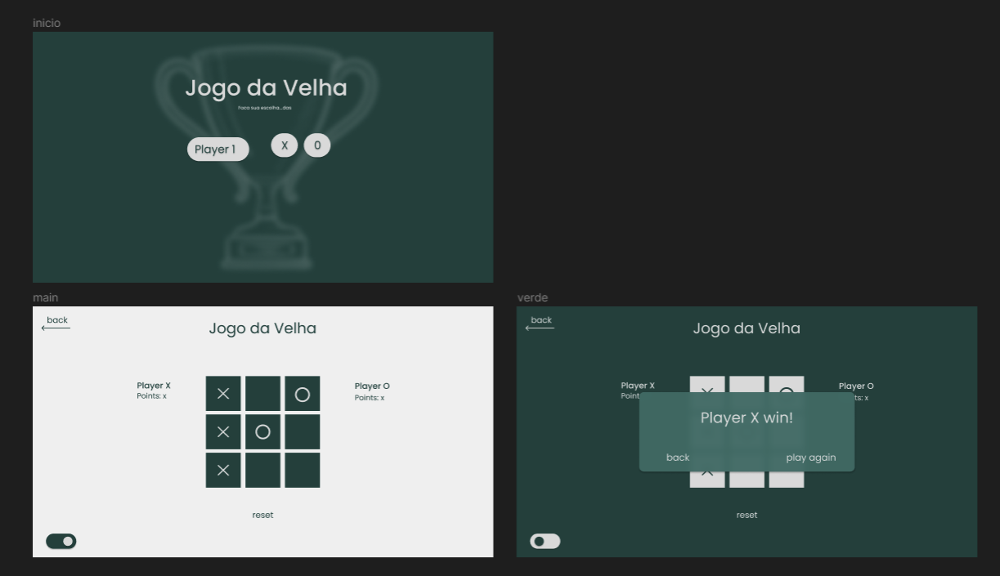

# Jogo da Velha

Repositório dedicado à implementação de um Jogo da Velha, desafio parte do Processo Trainee da Orc'estra de 2023.2.

## Requisitos do Projeto

### Requisitos Não-Funcionais

|ID|Descrição|
|---| ---------------------- |
|RQNF01|O projeto deverá ser desenvolvido na linguagem Javascript/Typescript utilizando o ecossistema React.|
|RQNF02|Todos os Requisitos funcionais dentro da sessão “Obrigatório” deverão ser desenvolvidos.|
|RQNF03|O projeto deverá ser criado para sistemas Web.|
|RQNF04|Não é permitido o uso de ferramentas de IA na criação do projeto.|

### Requisitos Funcionais Obrigatórios

|ID|Descrição|
|---| ---------------------- |
|RQ01|O usuário deverá ter uma opção de jogo: Dois Jogadores.|
|RQ02|O sistema deverá declarar a vitória de um jogador quando 3 de suas peças (X ou O) formarem uma linha, podendo esta ser horizontal, vertical ou diagonal.|
|RQ03|O sistema deverá declarar empate quando não houver espaços livres no quadro do jogo e os jogadores não tiverem obtido as condições de vitória.|
|RQ04|O sistema deverá alternar as jogadas entre X e O.|
|RQ05|O usuário deverá ter a opção de escolher se vai jogar como X ou como O.|
|RQ06|O usuário deverá ter a opção de recomeçar o jogo quando o sistema declarar a vitória ou o empate de um jogo.|
|RQ07|O usuário deverá visualizar um placar com o número de vitórias de cada jogador em ambos os modos de jogo.|
|RQ08|O usuário deverá ter a opção de reiniciar o placar.|
|RQ09|O sistema deverá resetar o jogo atual quando o placar for reiniciado.|

### Requisitos Funcionais Extras

|ID|Descrição|
|---| ---------------------- |
|RQ10|O usuário deverá ter duas opções de jogo: Um Jogador e Dois Jogadores.|
|RQ11|O usuário deverá ter a opção de trocar livremente entre os modos de jogo.|
|RQ12|O sistema deverá alternar as jogadas do usuário com as de um bot no modo Um Jogador.|
|RQ13|O bot deverá realizar suas jogadas em espaços livres no quadro do jogo de forma aleatória.|
|RQ14|O sistema deverá impedir o usuário de realizar sua jogada enquanto for a vez do bot no modo Um Jogador.|
|RQ15|O usuário deverá ter a opção de personalizar os nomes pelos quais os jogadores são identificados no placar.|

## Figma

A aplicação foi prototipada antes de ser desenvolvida, como segue nas imagens a seguir.

Para acessar o protótipo do Figma, [clique aqui](https://www.figma.com/file/tHgHHhe2NVWcWKbrZ1XGu3/jogo-da-velha?type=design&node-id=0-1&mode=design&t=2Zms5RuGfDGzizh2-0).

## Participantes

| Imagem | Nome |
| --- | -------------- |
|  | [Brunna Louise Martins Rocha](https://github.com/brunna-martins)|
|  | [Gabriela Dourado França](https://github.com/gabrieladouradof) |
|| [Gustavo Pereira Braz](https://github.com/gustavopbraz) |
|| [Rafael Carvalho Júnior Araújo](https://github.com/rafaelcarvalhoj) |
